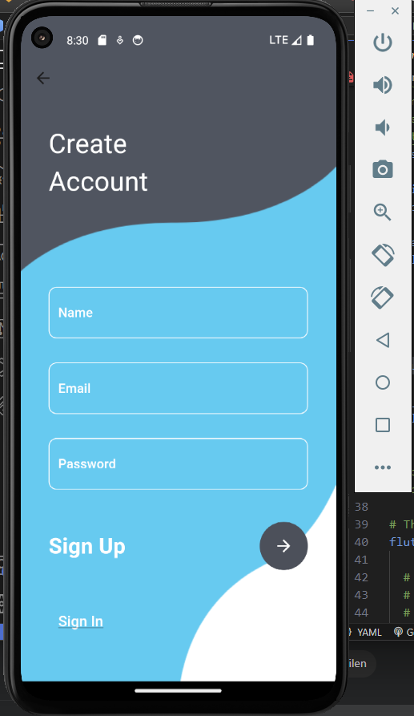
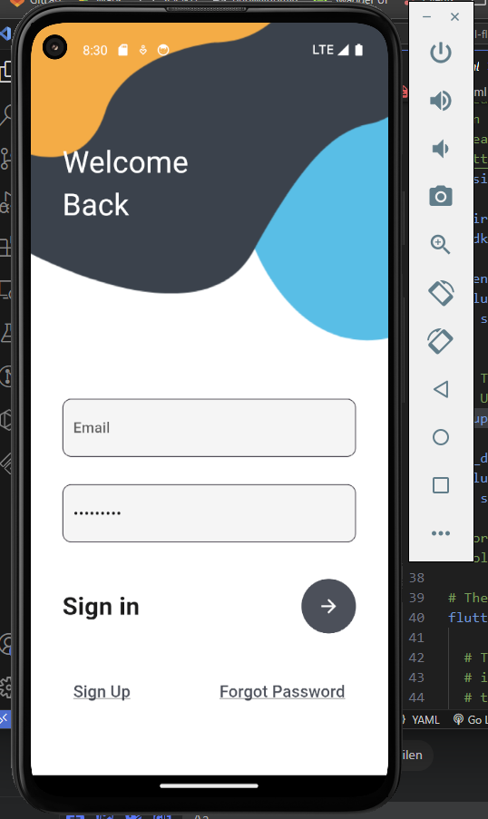

# Advanced Login and Register UI Flutter App

This is a Flutter application that features an advanced login and registration system. The app demonstrates the use of Flutter's navigation, stateful widgets, and custom styling.

## Features

- Login Screen
- Registration Screen
- Custom Styling
- Navigation between login and registration screens

## Getting Started

### Prerequisites

- Flutter SDK
- Dart SDK

### Installation

1. **Clone the repository:**

```sh
git clone https://github.com/jmrashed/advanced-login-register-flutter-ui-kit.git
```

2. **Navigate to the project directory:**

```sh
cd advanced_login_app
```

3. **Get the dependencies:**

```sh
flutter pub get
```

### Running the App

To run the app, use the following command:

```sh
flutter run
```

Make sure you have a connected device or an emulator running.

## Project Structure

```plaintext
advanced_login_app/
│
├── assets/
│   ├── login.png
│   └── register.png
│
├── lib/
│   ├── main.dart
│   ├── login.dart
│   └── register.dart
│
├── pubspec.yaml
└── README.md
```

### Code Overview

#### `main.dart`

This is the entry point of the application. It sets up the routes and initializes the app.

```dart
import 'package:advanced_login_app/login.dart';
import 'package:advanced_login_app/register.dart';
import 'package:flutter/material.dart';

void main() {
  runApp(MaterialApp(
    debugShowCheckedModeBanner: false,
    home: const MyLogin(),
    routes: {
      'register': (context) => const MyRegister(),
      'login': (context) => const MyLogin(),
    },
  ));
}
```

#### `login.dart`

This file contains the `MyLogin` widget, which builds the login screen UI.

#### `register.dart`

This file contains the `MyRegister` widget, which builds the registration screen UI.

### Assets

- `login.png` - Background image for the login screen.
- `register.png` - Background image for the registration screen.

### Customization

To customize the app, you can modify the UI components in `login.dart` and `register.dart`. You can also replace the background images in the `assets` folder with your own images.

## Demo 





## Contributing

Contributions are welcome! Please fork the repository and submit a pull request for any changes.

## License

This project is licensed under the MIT License - see the [LICENSE](LICENSE) file for details.
